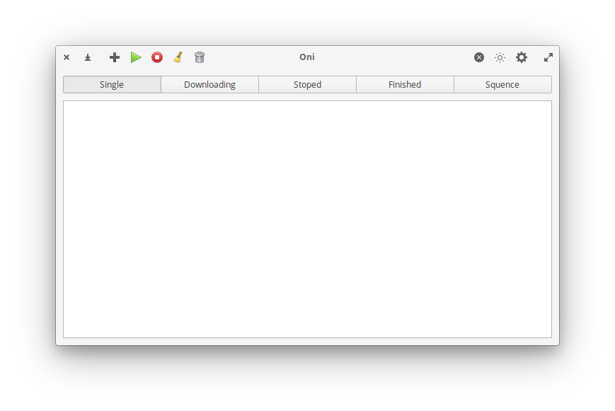

# Oni Simple Downloader

Oni Downloader.

## Building, Testing, and Installation

You'll need the following dependencies:
* aria2c
* meson
* libgranite-dev
* libgtk3-dev
* valac

Run `meson` to configure the build environment and then `ninja` to build and run automated tests

    meson build --prefix=/usr
    cd build
    ninja

To install, use `ninja install`, then execute with `com.github.torikulhabib.oni`

    sudo ninja install
